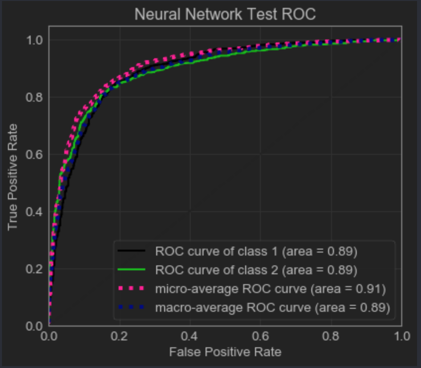
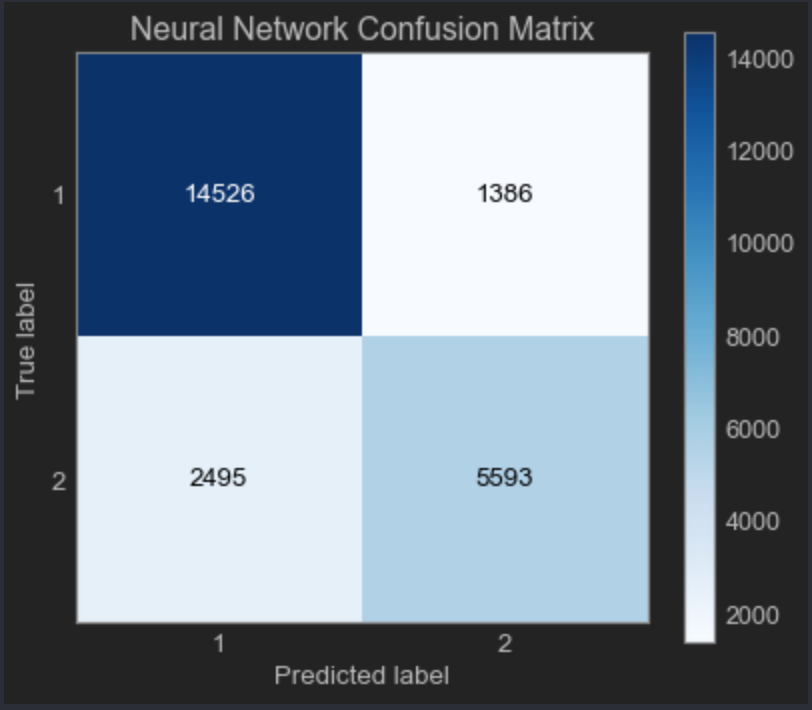
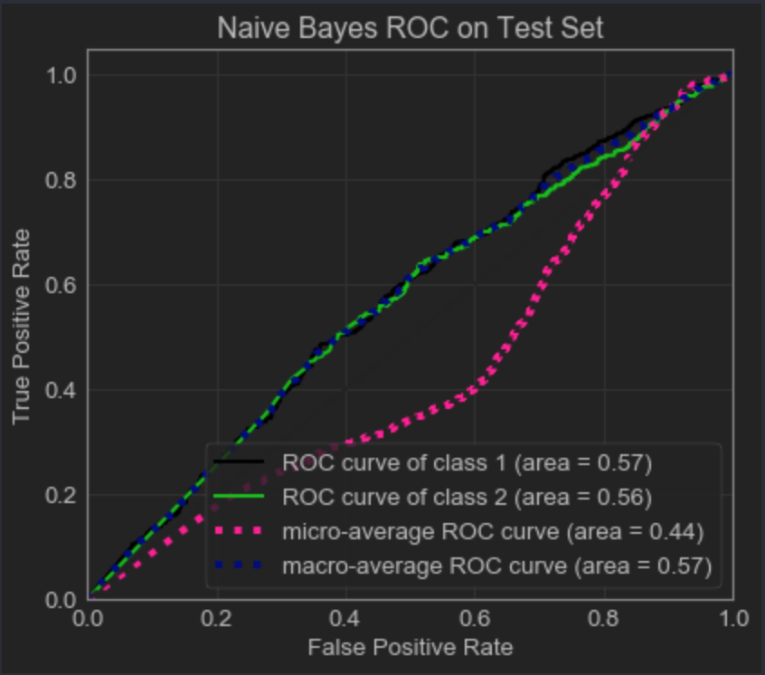
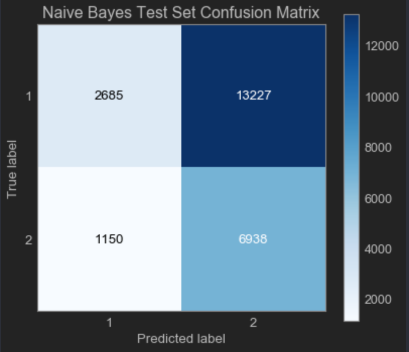

# MLNS_BCI_Project
Final Project for NEUR182: "Machine Learning with Neural Signals". This BCI Project was built by [Rishov Chatterjee](https:github.com/TheChanRProject), [Teresa Ibarra](https://github.com/teresaibarra), [Siena Guerrero](https://github.com/sienaguerrero), and [SiKe Wang](https://github.com/sikewang98) using information and data from the following paper: ["Decoding auditory attention to instruments in polyphonic music using single-trial EEG classification."](https://www.ncbi.nlm.nih.gov/pubmed/24608228)

## 5 Parts

### Part 1: Binary Classification for Unattended versus Attended

Merged and Labeled DevAttentionX data and Merged DevAttentionY data available on the Google Drive.

Please Note: Make sure to drop the first column from the dataframe when reading the csv files otherwise you will get an error when you instantiate your classifier in scikit-learn.

Please look at src/ml_experiments/logistic-regression/rishov-logistic-regression.py for the end to end template that is required for all the models.

## Best Model for Task 1: Random Forest 

- Random Forest
  - [Results](https://github.com/TheChanRProject/MLNS_BCI_Project/blob/master/results/Unattended_Attended/random-forest/results.md)
  - To Do
    1. Implement Cross Validation to Select Best Tree Estimator
    2. Visualize Best Tree Estimator
    3. Hyper-parameter Tuning of Random Forest
    4. Plot Feature Importance
    5. Compare with Gini Criterion
- Logistic Regression
  - [Results](https://github.com/TheChanRProject/MLNS_BCI_Project/blob/master/results/Unattended_Attended/logistic-regression/results.md)
  - To Do
    1. Implement Recursive Feature Elimination (RFE)
    2. Test Logistic Regression with Regularization Penalties (L1, ElasticNet)
- Linear Discriminant Analysis
  - Results (With Least Squares Shrinkage Parameter)
    1. Accuracy: 81.4%
    2. ROC Curve: 
    3. Confusion Matrix: 
- Neural Network
  - Results (Multi-layer Perceptron)
    1. Accuracy: 83.83%
    2. ROC Curve: 
    3. Confusion Matrix: 
  - To Do:
    1. Experiment with more deep layers, different activation functions
    2. Avoid overfitting with dropout, regularization, and SGD learning rate tuning
    3. Implement cross validation
- Naive Bayes
  - Results (Gaussian Prior)
    1. Accuracy: 40.1%
    2. ROC Curve: 
    3. Confusion Matrix: 
  - To Do
    1. Implement Stochastic Gradient Descent (SGD) Classifier with modified-huber loss function
    2. Use regularization: l1, l2, ElasticNet
    3. Implement cross validation
    4. If time available: Ensemble with AdaBoost  

### Part 2: Multi-Class Classification for Unattended versus Attended Including Instruments
- Multi-class LDA
- Neural Network
- Logistic Regression with Softmax
- Random Forest
- Naive Bayes

### Part 3: Finding Out the Most Important Features

- Relevance Vector Machine [If Time Available]
- Random Forest Feature Importance
- Naive Bayes Feature Importance
- Recursive Feature Elimination with Logistic Regression
- Stepwise Regression [If Time Available]

### Part 4: Putting it together in a paper

Resources:

[Classification of EEG data using machine learning techniques](http://lup.lub.lu.se/luur/download?func=downloadFile&recordOId=8895013&fileOId=8895015)

### Part 5: Building the poster

## Tasks:

1. Build a random forest

Tutorials to look at:

- [Will Koehrsen: Random Forest End to End](https://towardsdatascience.com/random-forest-in-python-24d0893d51c0)
- [Will Koehrsen: Visualizing the Random Forest](https://towardsdatascience.com/how-to-visualize-a-decision-tree-from-a-random-forest-in-python-using-scikit-learn-38ad2d75f21c)
- If Time Available: [Optimizing of Ensemble Classifiers using Genetic Algorithm](https://pdfs.semanticscholar.org/3ac5/fe864ef84b4b764f600ccf67c980d0e9ac94.pdf)

2. Build a logistic regression

Tutorials to look at:

- [Susan Li: Building a Logistic Regression in Python](https://towardsdatascience.com/building-a-logistic-regression-in-python-step-by-step-becd4d56c9c8)
- [William Cohen: Logistic Regression with Stochastic Gradient Descent](http://www.cs.cmu.edu/~wcohen/10-605/sgd-part2.pdf)
- [Scikit-learn Docs: SGD Classifier](https://scikit-learn.org/stable/modules/generated/sklearn.linear_model.SGDClassifier.html#sklearn.linear_model.SGDClassifier)

3. Build a Naive Bayes model

Tutorials to look at:

- [Gaurav Chauhan: All About Naive Bayes](https://towardsdatascience.com/all-about-naive-bayes-8e13cef044cf)
- [Naive Bayes with Scikit-Learn](https://github.com/2796gaurav/Naive-bayes-explained/blob/master/Naive%20bayes/Naive%20Bayes%20in%20scikit%20learn.ipynb)

4. Build a Neural Network

Tutorials to look at:

- [Neural Networks and Backprop in Scikitlearn](https://www.youtube.com/watch?v=X8SPO875mQY)
- [GitHub for the Above Video](https://github.com/shreyans29/thesemicolon/blob/master/Neural%20Networks%20and%20BackPropogation.ipynb)
