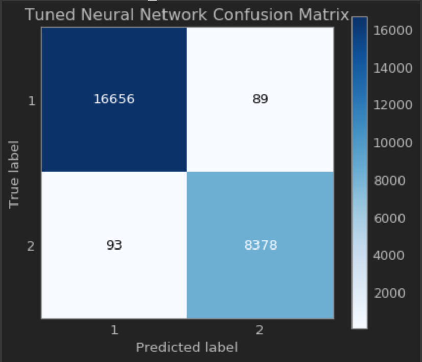

# Neural Network Results for First Classification Task

# Results Without Cross Validation

- ### Neural Network Model 1: Multilayer Perceptron with Sigmoid Function, No Penalty
  - Accuracy: 83.83%
  - ROC Curve: 
  - Confusion Matrix: 

# Results With Cross Validation [Si-Ke]

# Results With Cross Validation [Rishov]

- ### Neural Network: hidden_layer_sizes: (100,), adam, shuffle=True, learning_rate=adaptive
  - Accuracy: 99.1%
  - Confusion Matrix: 
