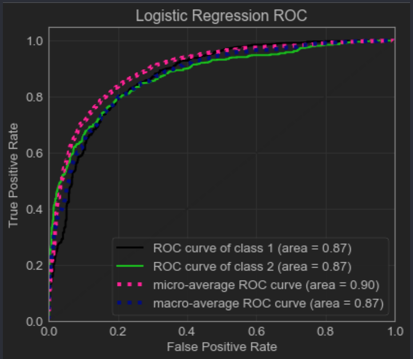
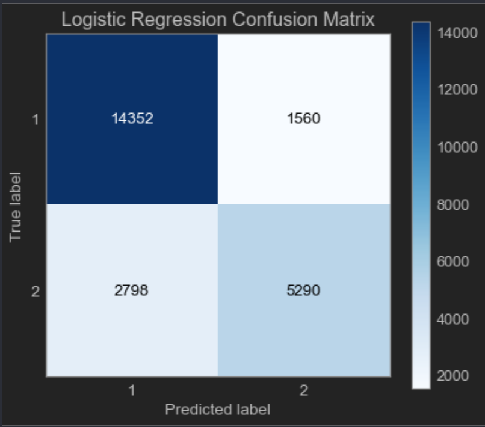
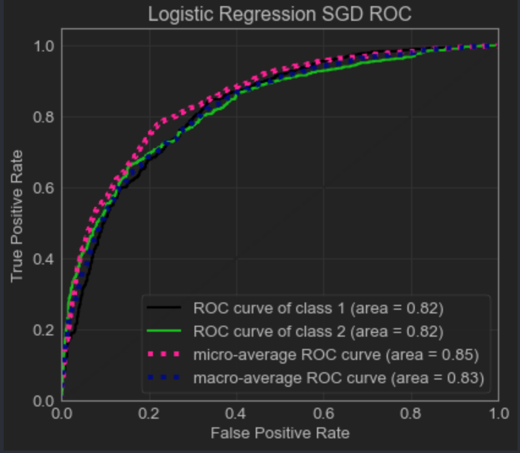
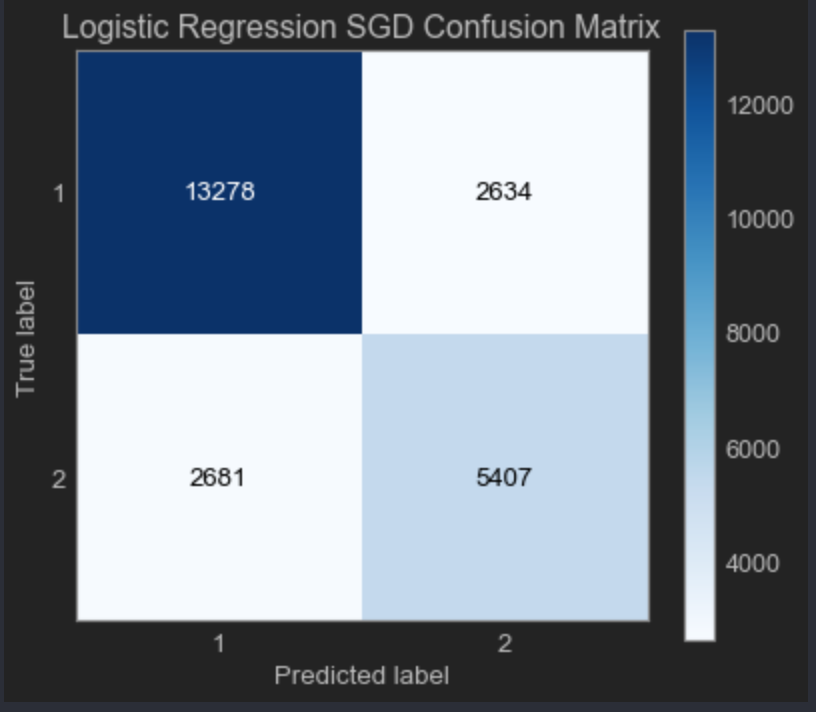
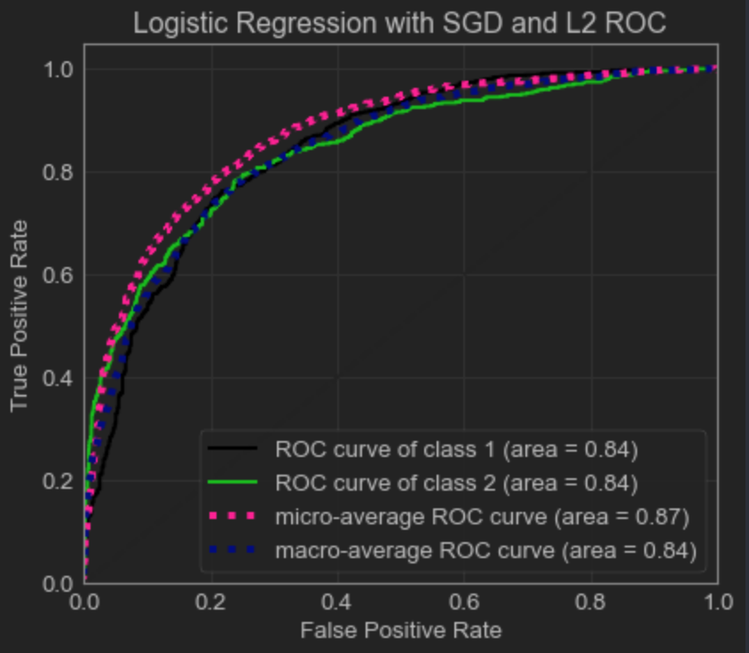
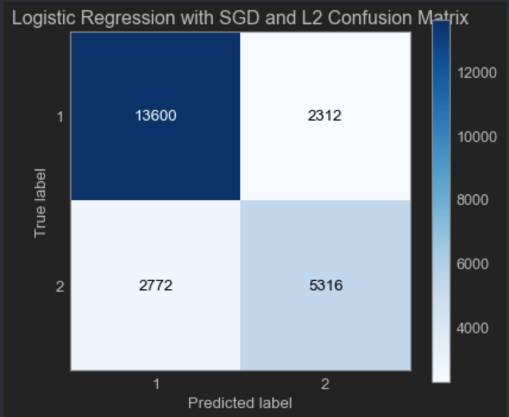

# Logistic Regression Results for First Classification Task

## Results Without Cross Validation

- Logistic Regression Model 1: No Recursive Feature Elimination and No Penalty
  - Accuracy: 81.84%
  - ROC Curve: 
  - Confusion Matrix: 

- Logistic Regression Model 2: Stochastic Gradient Descent (SGD) with No Penalty
  - Accuracy: 77.85%
  - ROC Curve: 
  - Confusion Matrix: 

- Logistic Regression Model 3: Stochastic Gradient Descent (SGD) with L2 Regularization
  - Accuracy: 78.82%
  - ROC Curve: 
  - Confusion Matrix:  
