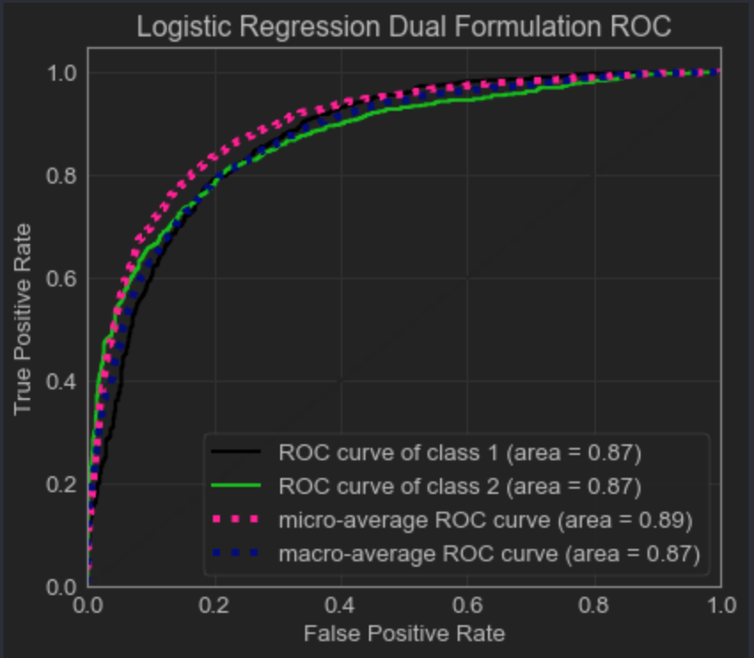
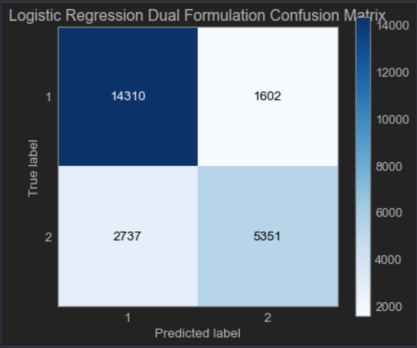
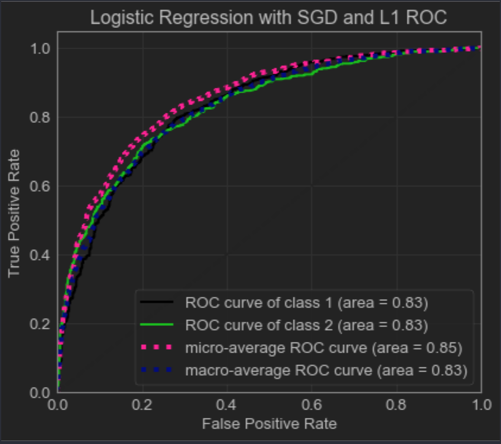
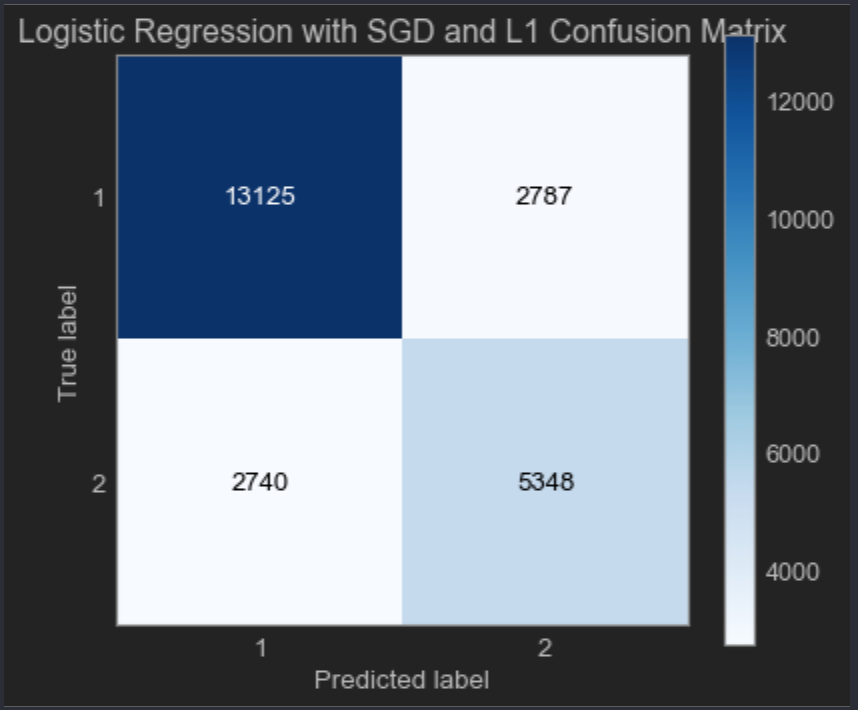
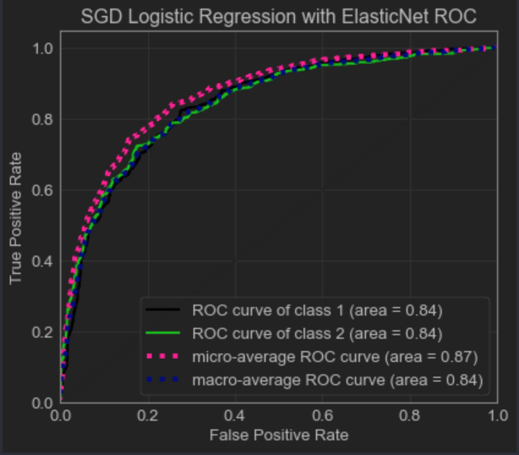
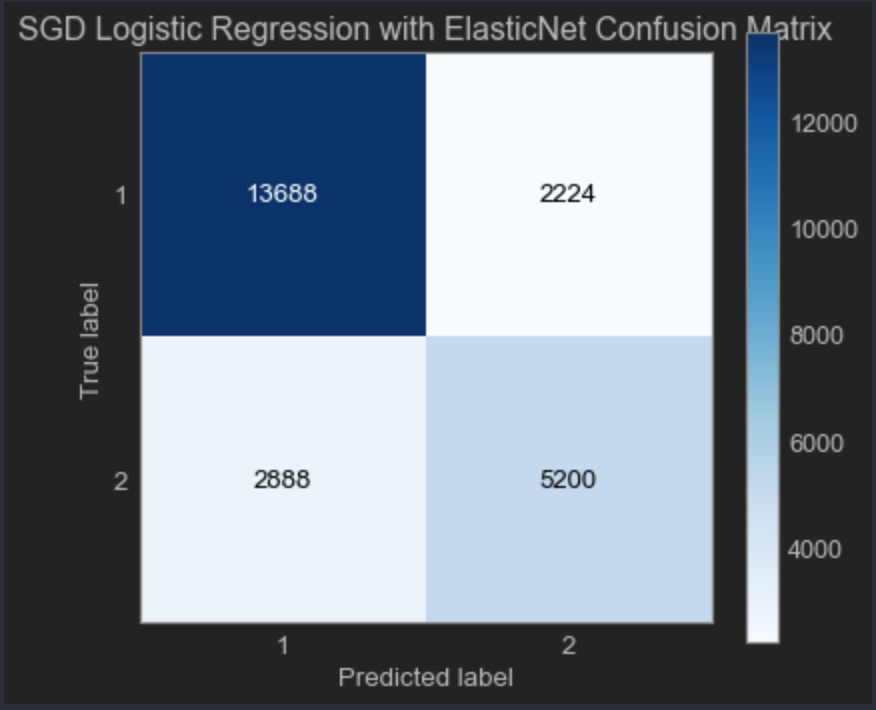

# Logistic Regression Results for First Classification Task

## Results Without Cross Validation

- ### Logistic Regression Model 1: No Recursive Feature Elimination and L2 Penalty
  - Accuracy: 81.84%
  - ROC Curve: 
  - Confusion Matrix: 

- ### Logistic Regression Model 2: No Recursive Feature Elimination, L2 Penalty with Dual Formulation and LibLinear Solver
  - Accuracy: 81.92%
  - ROC Curve: 
  - Confusion Matrix: 

- ### Logistic Regression Model 2: Stochastic Gradient Descent (SGD) with No Penalty
  - Accuracy: 77.85%
  - ROC Curve: 
  - Confusion Matrix: 

- ### Logistic Regression Model 3: Stochastic Gradient Descent (SGD) with L2 Regularization
  - Accuracy: 78.82%
  - ROC Curve: 
  - Confusion Matrix: 

- ### Logistic Regression Model 4: Stochastic Gradient Descent (SGD) with L1 Regularization
  - Accuracy: 76.97%
  - ROC Curve: 
  - Confusion Matrix: 

- ### Logistic Regression Model 5: Stochastic Gradient Descent (SGD) with ElasticNet
  - Accuracy: 78.7%
  - ROC Curve: 
  - Confusion Matrix: 
