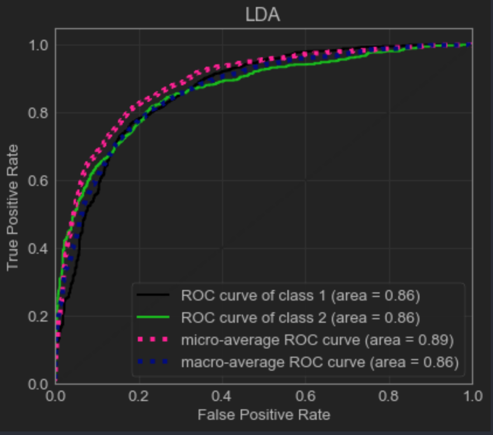
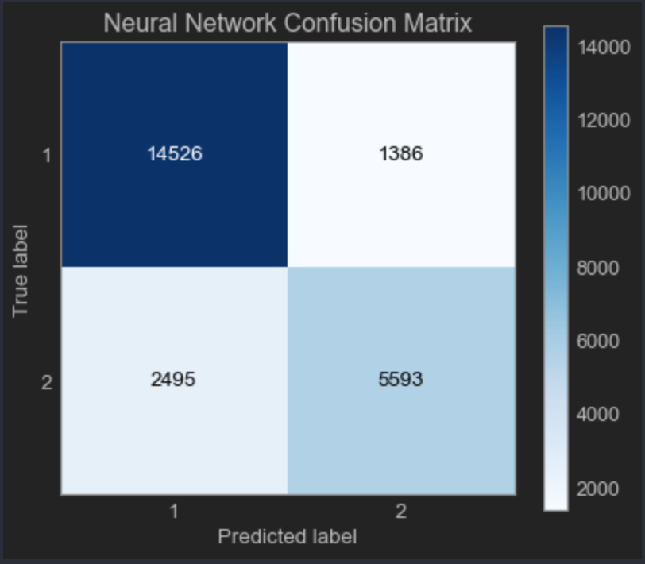

# Neural Network Results for First Classification Task

# Results Without Cross Validation

- ### Neural Network Model 1: Multilayer Perceptron with Sigmoid Function, No Penalty
  - Accuracy: 83.83%
  - ROC Curve: 
  - Confusion Matrix: 
